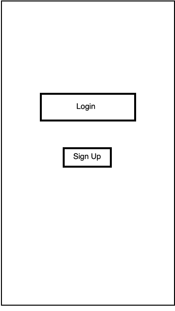
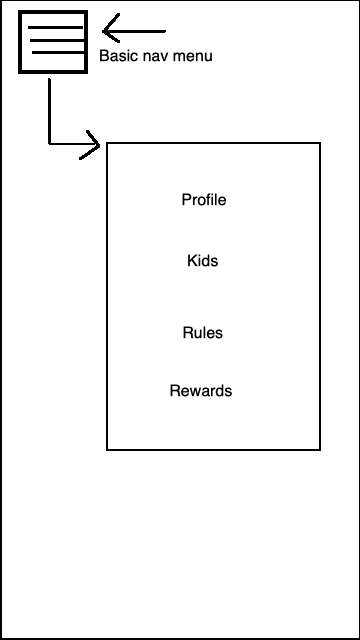
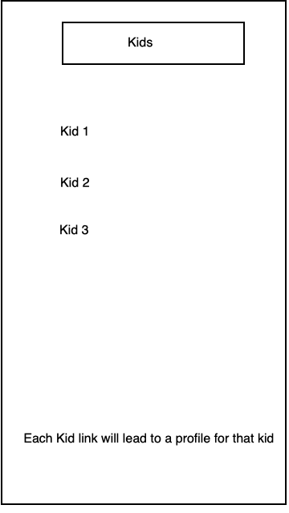
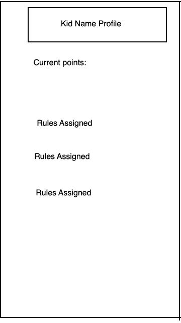
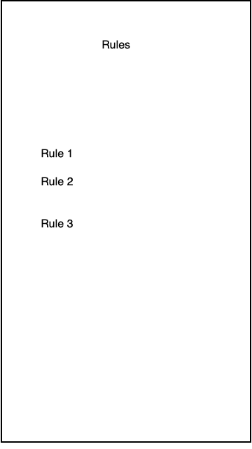
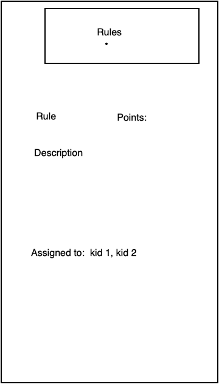
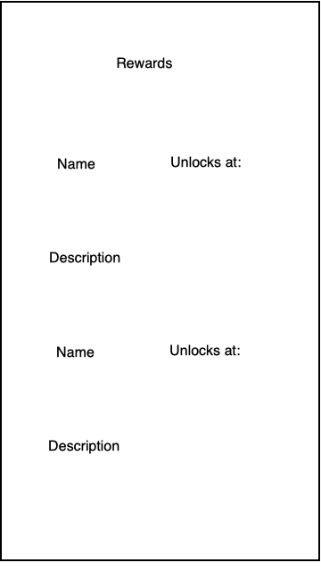

# kid-chart
This is going to be the web-app version of kid chart.
Current goal is to make this into a usuable django site, then make a django rest framework version to feed into a mobile-app friendly front-end.

Don't forget about Docker

will need to use
`poetry export -f requirements.txt -o requirements.txt`
since I'm using poetry instead of pip
don't forget to test this too
remember httpie

docker-compose up --build
docker-compose down
docker-compose restart
docker-compose exec web ./manage.py migrate
docker-compose exec web ./manage.py collectstatic

Stretch goal:
Ability to log in as a kid vs carer

Absolutely going to need to be able to customize what user accounts can see and add to in the database.

Profiles for each kid - maybe like a summary page of each kid's points and actions?

Reference:
https://docs.djangoproject.com/en/3.0/ref/models/fields/
https://docs.google.com/document/d/1dTbL_GFY4UTfZzhZOvZFihed1t2qu0SUb0qIo6HvE_0/edit

Might design using tailwing(https://tailwindcss.com/) or bootstrap

### Architecture

#### Models:

- User
    - name - this is intended to be for the parent or whoever is in charge of taking care and setting rules
    - will need to be able to fill out data-base/API from UI, and have it be unique for each user. Admin site should be for me only, but user will need to be able to update their own set of rules and kids

    - can maybe use the built in user model from permissions?

    - foreign keys pointing to kid and rules

- Kid
    - name
        - string
    - points counter - influenced by rules
        - int

- Rule
    - will need a "weight" value/points value
        - int
    - name
        - string
    - description
        - string
    - will need to be assigned to kids somehow

I'll need a model relationship diagram here

## Wireframes

### login page --> /login

Currently only have plans for parent/caretaker profiles. Kid profiles may be a goal for the future.

### navigation page --> Part of the "base" template

will exist as a template partial built into the base

### kid list --> /kids

List of all kids the user is in charge of

### kid profiles --> /kids/kid_id

Page for specific kid. Links from the kid list page. Can edit rules assigned to specific kid from here

### rules list --> /rules

List of all rules user has for their account.

### rules detail --> /rules/rules_id

Detail view for rules, containing descriptions, weight/points.Goal is to be able to assign same rule to multiple kids at from this page

### rewards --> /rewards

List of rewards for doing tasks, and the points they can become available at. Doesn't currently influence the other parts of the databse.

## User stories

[-] as a user, I want a personalized account so that I can keep track of my set of kids and rules
[-] as a user, I want to be able to assign points to kids based on rules/chores, so I can check how they're keeping up with stuff at a glance

## Tests
[-] test that route return 200
    [-] route 1
    [-] route 2 etc
[-] test that a 404 redirects to an error page
[-] test for inputs

### Notes:
 7/24: temporarily stopping base tutorial here: https://developer.mozilla.org/en-US/docs/Learn/Server-side/Django/Testing to focus on getting views, permissions, and wireframes locked in.

8/4: I'm going to try to refactor by splitting the Rule model off into it's own app, so I can 1: reference it within the Kid model the way I want to, withouth the call stack gettin in the way, and 2: maybe access it more easily from the kids app. Don't know if it'll work yet, but current stuff is causing trouble so might as well try.

8/7: next step is figuring out how to assign instances of rules to kids. Currently all rules will display, since Kid Instance isn't communicating to Rule Instance. Going to need to be able to view and edit rules that are attached to specific kids. I think I WILL need a rules instance, but WON'T need a kid instance.

8/14: models probably fine, or mostly fine as they are. Next, I will need: a button attached to each child that: creates a new instance of a rule, and assigns it to that child. All rule instances assigned to a child should display on that child's page.

8/26: updated models to better accomplish what they needed to do. Should be able to assign rule instances to kids. Next up: start assigning rules to kids via admin, then via accessible UI, display rules assigned to kids.